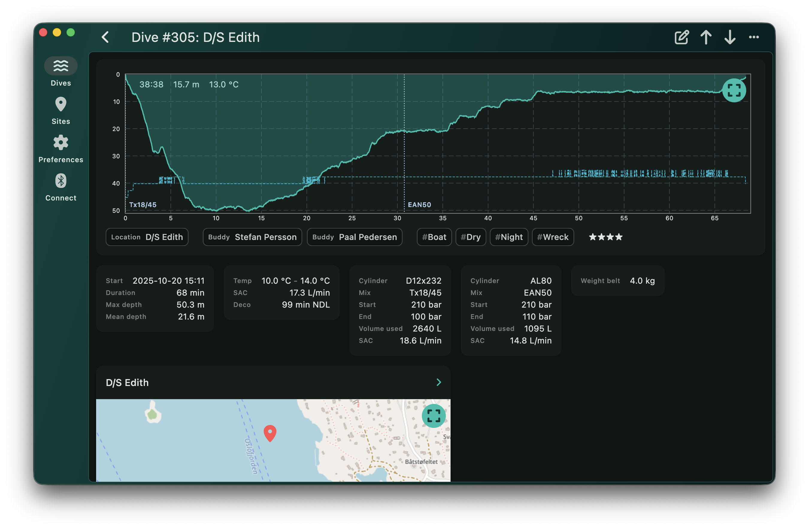

# Bubbletrail

Bubbletrail is a dive log. It helps you log dives.

## Features

- Intuitive user interface
- Management of dives and dive sites
- Display of technical and deco data for dives
- Cross platform [syncing](syncing.md)
- Import of dives from supported dive computers using Bluetooth LE
- Free and [open source](https://github.com/bubbletrail/bubbletrail/)

Currently supported platforms are macOS and iOS. Android and Windows support
is possible and planned.

## Screenshots

{: width="250"} {: width="250"}
