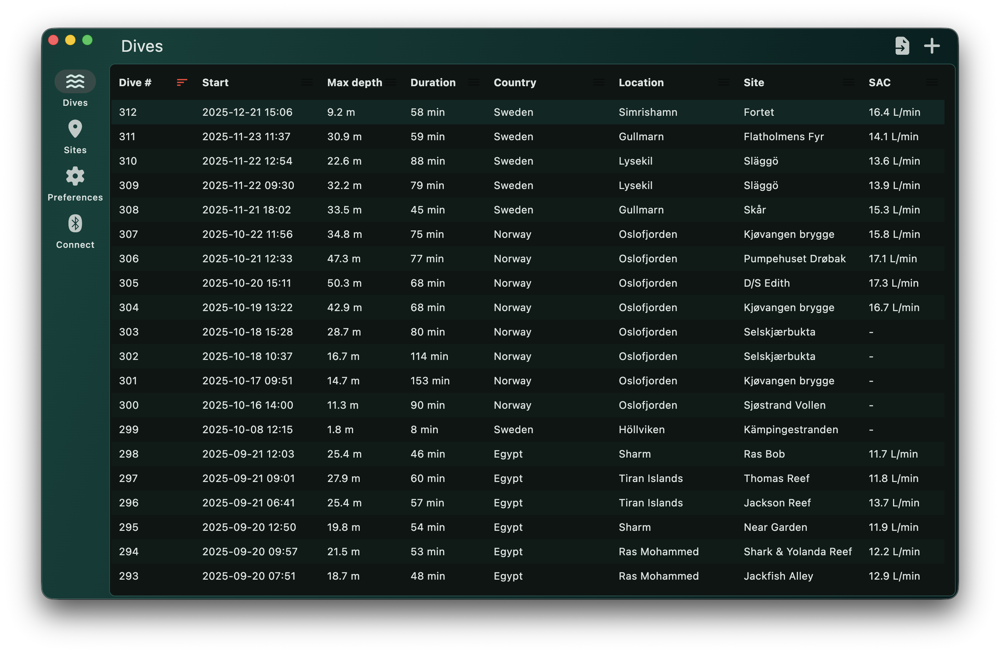
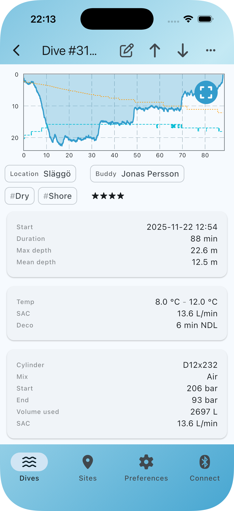

# About

Bubbletrail is a free, open-source dive log for recording and organising
your scuba dives. It connects directly to dive computers over Bluetooth,
imports logs from Subsurface and other programs, and displays dive profiles
including depth, temperature, tank pressure, and calculated deco. Whether
you're a recreational diver or into technical diving with multiple gas
mixes, Bubbletrail keeps your dive history in one place.

The app aims for a modern, intuitive interface and surfaces best-practice
metrics like surface gradient factors (SurfGF) to help you understand your
dives better.

## Features

- Management of dives and dive sites
    - Tag and describe dives and sites
- Import of dives from supported dive computers using Bluetooth LE
- Display of technical and deco data for dives
    - Dive computer reported deco ceiling
    - Internal Buhlmann calculated deco ceiling and SurfGF
- Cross platform [syncing](syncing.md)
- Import of logs in Subsurface, MacDive and UDDF formats
- Export of logs in Subsurface format
- Free and [open source](https://github.com/bubbletrail/bubbletrail/)

Currently supported platforms are macOS, iOS, and Android.

## Downloads

- For macOS, grab the app from the [latest GitHub release][gh].
- For iOS, download the app from the [App Store][as].
- For Android, download the app from the [Play Store][ps].

## Contact & support

For support, questions and general discussion, please use the [Bubbletrail
Discussion forum](https://github.com/orgs/bubbletrail/discussions) on
GitHub. For clear feature requests and bug reports you can [directly file an
issue](https://github.com/bubbletrail/bubbletrail/issues), however it's
often better to discuss beforehand in the forum.

## Screenshots

### macOS

### iOS

[gh]: https://github.com/bubbletrail/bubbletrail/releases/latest
[as]: https://apps.apple.com/app/id6756735362
[ps]: https://play.google.com/store/apps/details?id=app.bubbletrail.bubbletrail
